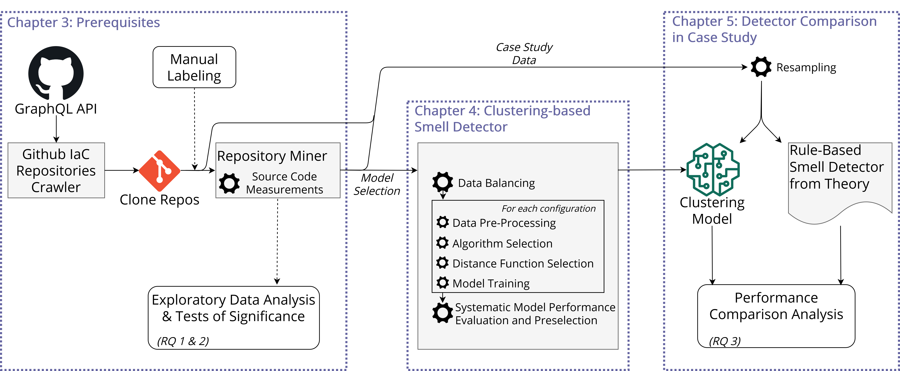

# TOSCA Research and Clustering-based Smell Detector

This repository contains the software artifacts created for my research upon the [TOSCA](https://www.oasis-open.org/committees/tc_home.php?wg_abbrev=tosca) Infrastructure as Code framework. In this research, we developed a smell detector based on clustering to detect the smells *Duplicate Block*, *Too many Attributes*, and *Insufficient Modularization*. The schematic diagram provided below summarizes this study. All data and information required to reproduce the study is included in this repository. Furthermore, a short description is provided for resrearch reproduction, but also an explanation how to use the smell detector on developer's own TOSCA blueprints.



For more information concerning the conducted research, please consult the [thesis document](./research/thesis.pdf). 


## Requirements
First, install the necessary dependencies listed in the requirements.txt file. Then, install the tosca-metrics module.
* [requirements.txt](requirements.txt)
* [tosca-metrics](https://github.com/stefanodallapalma/tosca-metrics) module


## Use Smell Detector

Determine if a TOSCA blueprint suffers from one of the Duplicate Block, Too many Attributes, or Insufficient Modularization smell by executing the following command:

```
python <path>/detector/clusteringdetector.py <path-to-blueprint>
```

## Reproduce Research

For research reproducibility, we briefly touch upon the executed pipeline.

### Data Collection
To collect the data set used for this study, do the following:

* Go to the script [dataminer/miner.py](dataminer/miner.py)
* Enter your personal API token to access the GraphQL API by Github
* If desired, change the time range for which you want to search for repositories
* Call the script
```
python  <path>/dataminer/miner.py
```
* Perform the first preprocessing by calling
```
python  <path>/dataminer/file_evaluation.py
```

Afterwards, the obtained TOSCA blueprints can be found [here](/dataminer/tmp).

### Analyses
The Exploratory Data Analysis creates distribution graphs, correlation matrices, and statistics tables used to explore the obtained data. To obtain them, execute the following:
```
python  <path>/analysis/exploratory_data_analysis.py
```

The next conducted analysis provides insight in the statistical difference between predefined groups within our data set. Again, we create graphs and tables to interpret these results.
```
python  <path>/analysis/tests_of_significance_analysis.py
```

### Clustering-based Smell Detector
The clustering-based Smell Detector is covered by two main classes [ClusterConfigurator()](analysis/classes/clusterconfigurator.py) and [SmellEvaluator()](analysis/classes/clusterevaluator.py). An example of them being used is provided in the case study. 

### Case Study
In the case study, we train a determine the best possible configuration for the data set we obtained, and report on the performance observed. To reproduce this part, call the following script by:
```
python  <path>/analysis/case_study.py
```